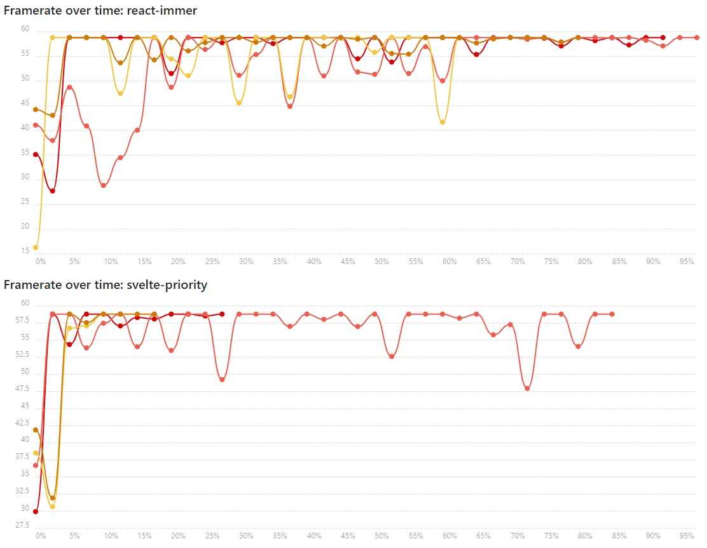

## Performance





## Testing

```
npm run build
npm start
> https://localhost:13337/
```

Click "Run Benchmark" to run the entire suite.

Alternatively you can run individual tests, which is handy when debugging new apps or tests:

https://localhost:13337/tests/render/test.html?cache=false&app=react-immer
https://localhost:13337/tests/deps/test.html?cache=false&app=preact-immer
https://localhost:13337/tests/big-state/test.html?cache=false&app=preact-copy
